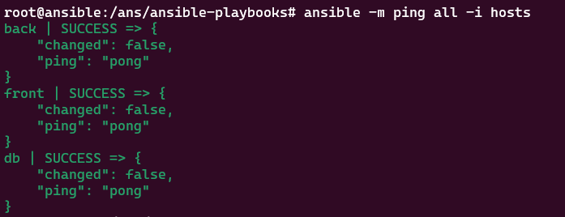

# ansible-laba
- В данном репозитории собрано всё, что нужно для лабораторок по ansible
- Узлы лабы поднимаются в контейнерах через docker-compose 
- Так как всё в контейнерах, удобно откатывать узлы назад - просто удалить контейнер
- Есть готовые варианты для LAMP/LEMP стека и классического приложения front, back, db

## Запуск лабы

Чтобы начать работу с лабой, нужно собрать два Dockerfile

```sh
docker build -f ansible.Dockerfile . -t ans            # собираем образ для ансибла
docker build -f ub-lab.Dockerfile . -t my-ub           # собираем образ для убунты, с которой будем работать
```

Далее запускаем docker-compose

```sh
docker-compose up -d
```

После запуска docker-compose зайти в контейнер с ансиблом 

```sh
docker exec -it ans bash
```

и сгенерировать новый ssh ключ

```sh
ssh-keygen
```

Далее раскидать ключ по участникам лабы (пароль написан в ub-lab.Dockerfile по умолчанию 123)

```sh
ssh-copy-id root@front
ssh-copy-id root@back
ssh-copy-id root@db
```

и сделать 

```sh
ansible -m ping all -i hosts
```

Пример того, как должно выглядеть, если всё ок



Если пинг проходит, значит лаба готова к запуску ролей

